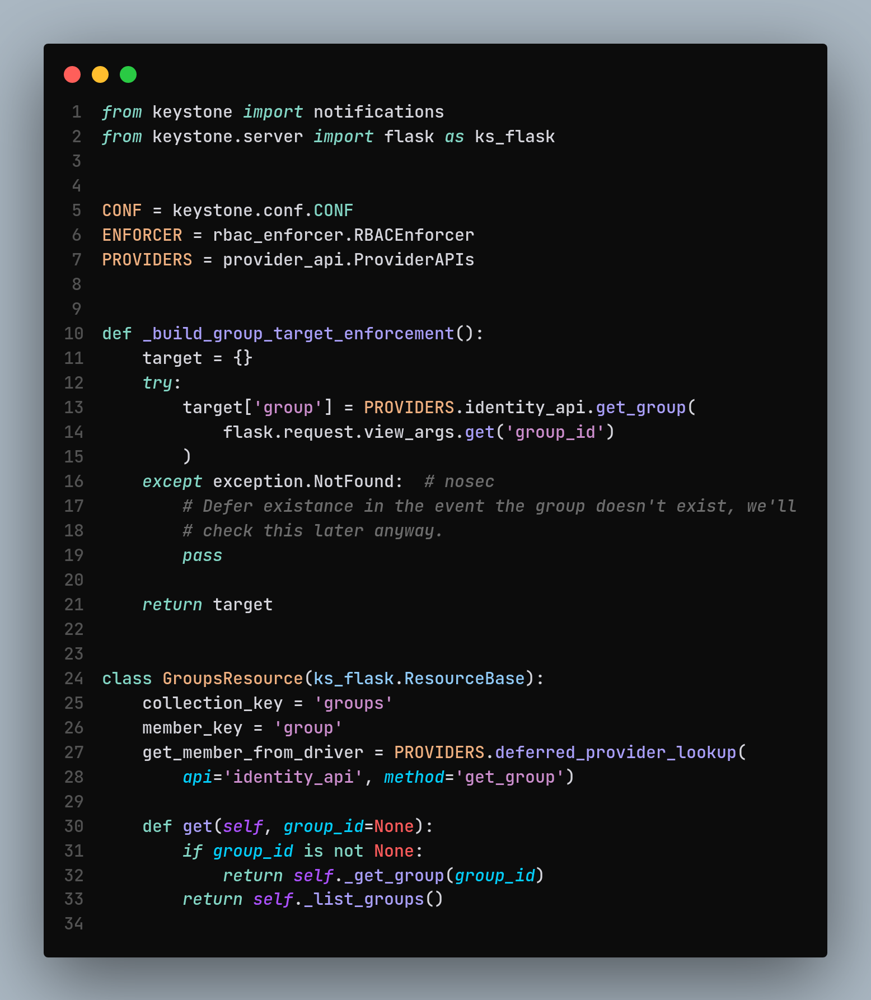

# Stannum VS Code Theme

This theme is based off [Jetbrains Fleet Theme](https://marketplace.visualstudio.com/items?itemName=MichaelZhou.fleet-theme), which is based off Jetbrains Fleet, now defunct. This is **not** intended to be an exact clone of Fleet's original coloring scheme.

## Targeted Languages

While this theme provides basic support to all languages, the initial focused languages are:

* YAML
* JSON
* Shellscript
* Golang
* Python
* Rust
* Dockerfile
* Markdown

## Screenshots

### Python

## Install

Install from the [Microsoft VSCode Marketplace](https://marketplace.visualstudio.com/items?itemName=stannum.stannum).

## Contribute

Feel free to open issues, provide feedbacks, and create pull requests at [Github repository](https://github.com/stannum-l/vscode-stannum-theme).
