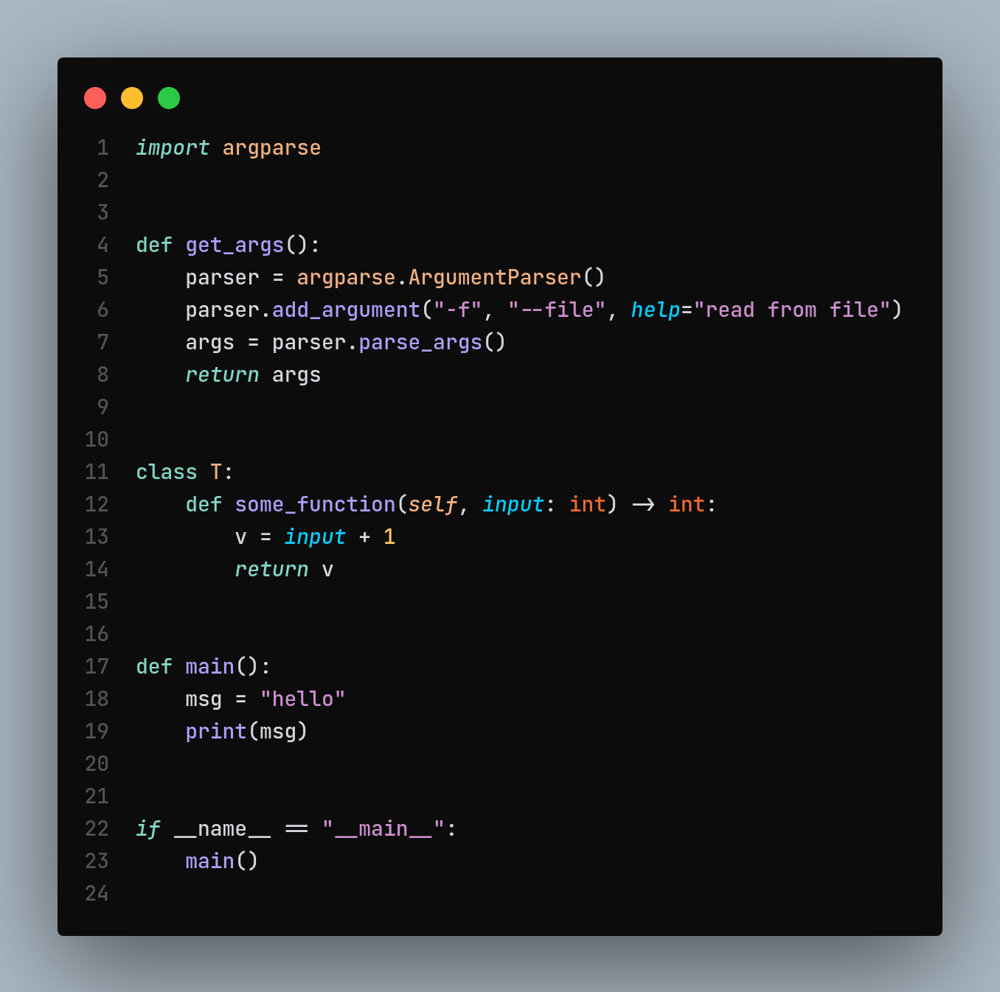
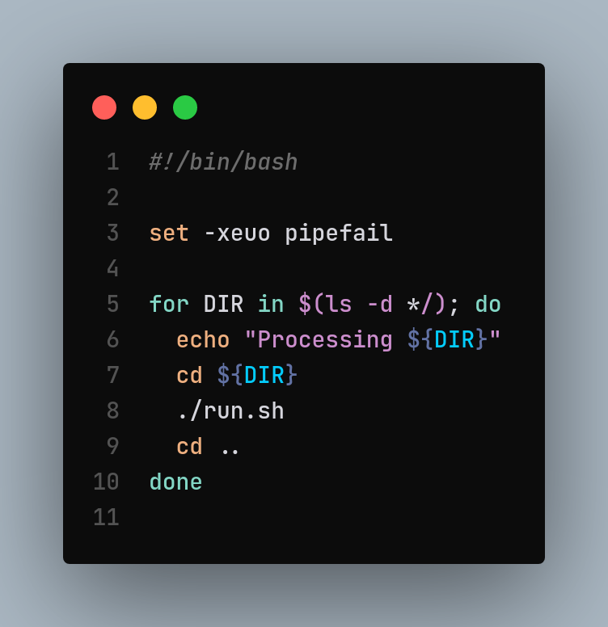

# Stannum VS Code Theme

This theme is based off [Jetbrains Fleet Theme](https://marketplace.visualstudio.com/items?itemName=MichaelZhou.fleet-theme), which are based off the looks and feels of [Jetbrains Fleet](https://www.jetbrains.com/fleet).

## NOTE:

Prior to 0.1.0 release, consider this a developmental plugin.
While it should work as expected, there will be a lot of frequent update.
Feel free to put comments in the [Github repository](https://github.com/stannum-l/vscode-stannum-theme) so ideas can be incorporated for the 0.1.0 release.

This is not intended to be an exact clone of Fleet's coloring scheme.

## Targeted Languages

While this theme provides basic support to all languages, the initial focused languages are:

* yaml
* json
* shellscript
* golang
* python
* rust
* helm templates
* dockerfile
* markdown
* asciidoc

## Screenshots

### python

### bash script

## Install

Install from the [Microsoft VSCode Marketplace](https://marketplace.visualstudio.com/items?itemName=stannum.stannum).

## Contribute

Feel free to open issues, provide feedbacks, and create pull requests at [Github repository](https://github.com/stannum-l/vscode-stannum-theme).
